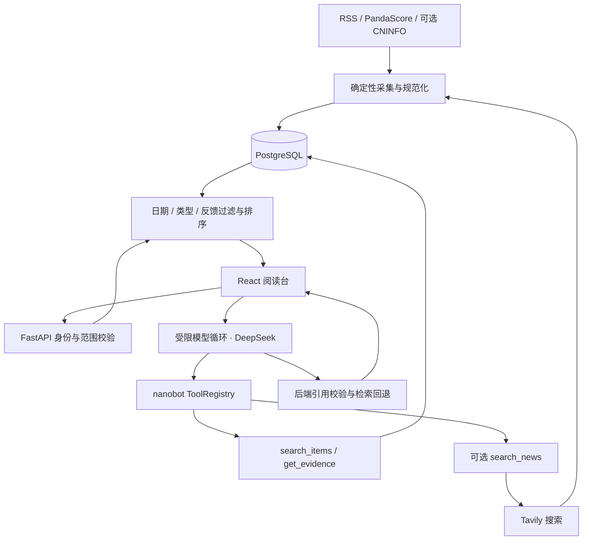

# 阅讯 · Signal Desk

面向个人关注对象的资讯 Agent：订阅股票和 CS2 战队，收集近期消息，按兴趣反馈排序，使用受限模型工具调用回答问题并附上证据。

**[在线演示](https://signal-desk-demo.onrender.com/) · [源码](https://github.com/bourdon276/signal-desk) · [项目盘点](docs/project-status-20261008.md)**

更新：2026-10-09。已公开部署，已收到朋友体验反馈，DeepSeek 与 Tavily 已在部署实例配置。新闻供给与多用户效果仍在验收；新增关注不代表来源必然覆盖该对象。免费实例休眠后首次访问可能需要等待约一分钟。

## 能做什么

- 邀请注册与登录；添加六位 A 股代码或 CS2 战队名称，绿龙规范化为 Team Spirit。
- 新闻展示近30天内容；比赛单独展示近30天记录和未来7天赛程，不用历史比分填充新闻。
- 选择近期新闻、采访、阵容与转会；股票可选择财报与业绩。选择类型筛选库存，点击“搜索这个关注的新消息”才发起联网搜索。
- 卡片展示概况、日期、来源、已读状态与原文链接；赛事 API 记录明确没有原文网页。
- 资讯卡片可点击“译成中文”，使用已配置模型翻译标题和短摘录，保留原文；7天共享缓存、并发租约、模型预算和运行日志，不翻译未收录的全文。
- 选择CS2战队后，可粘贴完美世界电竞分享链接加入近30天相关文章；平台访谈标签用于采访分类，每人每天最多读取5次，无需新增密钥。
- 同事件来源折叠在一张卡片，可展开其他原文链接。支持已核实转载对与同对象同日长标题一致分组；不代表通用跨语言语义去重。
- “感兴趣 / 少看这类 / 重复消息”持久化为反馈事件。偏好按用户、关注对象及内容类型或来源计算，可撤销。
- 默认问答检索已入库证据；勾选模型工具问答后，模型选择工具并组织回答。可选库存不足时补搜一次。
- 展示工具轨迹、token、估算费用、来源同步状态，以及质量过滤、类型过滤、反馈隐藏数量。

### 数据来源与边界

| 内容 | 路径 | 当前限制 |
| --- | --- | --- |
| 股票新闻 | Tavily 搜索白名单媒体及公告链接 | 搜索摘录与日期未经全文核验；不能保证任意代码均有新闻 |
| 正式股票公告 | CNINFO 适配器 | 需独立凭据与展示许可，当前未启用正式接口 |
| CS2 战队报道 | Dust2 Brasil RSS、Esports Insider RSS、Tavily | Dust2为完美世界该篇采访的原始媒体来源；每小时读取最新RSS，葡语标题，未补齐近30天历史报道；采访标题分类仍可能漏判 |
| 完美世界电竞分享 | 固定公开详情适配器 + 分享链接导入 | 读取已知链接的摘要/日期/采访标签；可粘贴新链接，无全站新闻发现；[使用说明](docs/perfect-world-source-setup.md) |
| CS2 比赛 | PandaScore Fixtures | 来源分页和状态可能不完整；明确区分比赛与新闻 |
| 黄金宏观背景 | 美联储 RSS | 不提供完整伦敦金新闻、实时行情或交易建议 |
| 人工历史样本 | 经核对的链接与短概况 | 用于演示和历史评估，不冒充实时自动采集 |

尚未实现：私有阅读源、AI周报、外部通知、完整 LoL/Valorant 自动采集、跨站语义事件归并、向量检索。真实文章验收见[新闻供给审计](docs/eval/news-supply-audit-20261009.md)。

## 为什么不只装一个 Skill

Skill 可以辅助个人查消息。阅讯负责持续保存多用户关注、阅读和反馈，提供浏览入口，统一采集与检索，执行日期、身份、引用和预算限制，并在失败时保留已有信息。Skill 可以调用这套服务；本项目的价值在这些可运行、可观测的产品机制。当前是受限工具调用 Agent，不是多 Agent 或自主研究系统。

## 架构与技术栈



Python 3.12、FastAPI、nanobot-ai 0.3.5 ToolRegistry、SQLAlchemy、Alembic、PostgreSQL、httpx、feedparser；React、TypeScript、Vite；Docker 与 Render。自有主机另提供 Caddy 配置。

### Agent 的执行边界

- 模型默认最多3轮；允许补搜时最多4轮；工具总数最多6次，只补搜一个关注对象一次。
- 工具身份由后端登录态绑定，模型不能指定其他用户。检索最多5条，证据摘要最多500字。
- 模型请求序列化上限16KB、输出上限800 tokens、问答总超时40秒。
- 工具内容作为不可信数据处理；没有任意 URL、Shell、文件写入工具。后端用已取得的证据重建链接。
- 缺证据不推断外部没有新闻；无效引用、超时或模型失败时回退检索，并展示原因。

[工程设计与面试说明](docs/engineering-notes.md)详述上下文、记忆、安全、成本与失败案例。

## 本地启动

要求 Python 3.12、uv、Node.js/npm 和 Docker 兼容运行时。

```bash
uv sync
cp .env.example .env
```

编辑 `.env`：让 `DATABASE_URL` 与 `POSTGRES_PASSWORD` 使用同一条本机口令，替换 `APP_SECRET`、`ADMIN_TOKEN`。Colima 用户先运行 `colima start`。

```bash
docker compose up -d db
uv run alembic upgrade head
uv run python -m information_agent.ingest_fed
# 可选：导入明确标为人工收录的历史演示链接
uv run python scripts/import_demo_links.py
npm --prefix web ci
npm --prefix web run build
uv run uvicorn information_agent.main:app --reload
```

访问 `http://127.0.0.1:8000/`。`/health` 检查进程，`/ready` 检查数据库，`/docs` 为 API 文档。公开实例注册需要维护者单独提供的邀请码。

前端开发：后端运行时执行 `npm --prefix web run dev`，访问 `http://127.0.0.1:5173/`。前端修改后重新构建即可由 FastAPI 提供。

周期采集：`uv run python -m information_agent.sync_worker`。本地单独启动此进程；部署实例可设置 `SYNC_IN_WEB=true`。免费服务休眠期间不会持续采集。

停止数据库用 `docker compose down`，命名卷保留数据；`docker compose down -v` 会删除本地数据库。Colima 可用 `colima stop` 释放运行时资源。

## 环境变量

密钥仅放本机 `.env` 或 Render Environment，不提交到 Git。

| 用途 | 设置 |
| --- | --- |
| 基础服务 | `DATABASE_URL`、`APP_SECRET`、`ADMIN_TOKEN`、公开部署的 `REGISTRATION_CODE` |
| 周期同步 | `SYNC_IN_WEB=true`（部署内运行时）；独立 worker 不需此开关 |
| 比赛来源 | `PANDASCORE_TOKEN`；[配置说明](docs/team-source-setup.md) |
| 新闻搜索 | `SEARCH_ENABLED=true`、`TAVILY_API_KEY`；[配置说明](docs/search-setup.md) |
| 正式股票接口 | `CNINFO_ACCESS_TOKEN`、`CNINFO_DISPLAY_ALLOWED=true`；[配置说明](docs/stock-api-setup.md) |
| 模型 | `MODEL_ENABLED=true`、`MODEL_API_KEY`、`MODEL_BASE_URL`、`MODEL_NAME` 与非零输入/输出价格；[配置说明](docs/model-agent-setup.md) |

模型价格按人民币/百万 tokens 配置；使用供应商当时报价。默认模型上限为月¥50、日¥3、单次预留¥0.5，每用户每日最多10次。费用为 token 与配置价格的估算，不等同供应商账单。

搜索默认全站每日20、每月600 credits，每用户每日5次新请求。固定 basic 请求预留1 credit；失败也计入额度。对象共享成功缓存6小时、零结果15分钟、失败5分钟，并使用数据库租约限制并发。搜索与模型预算分别计算，项目总预算目标为¥200/月，尚未完成月度账单验收。

## 部署

当前演示使用 Render Web + PostgreSQL。可参考 [`render.yaml`](render.yaml)、[`render-existing.yaml`](render-existing.yaml)；[Blueprint 入口](https://render.com/deploy?repo=https://github.com/bourdon276/signal-desk)会先显示待创建资源。

1. 通过 GitHub provider 连接仓库，关联 `main`；设置私密环境变量与数据库连接。
2. 部署后确认 Render 为 Live，再查看 `/ready` 与页面版本。仅点击 Save Only 保存变量不会更新正在运行的实例。
3. 自动部署需要仓库授权、关联分支和 On Commit 配置均生效；YAML 中 `autoDeployTrigger: commit` 本身不能证明已触发。
4. 代码或进程配置变更需要部署；添加关注、提交反馈、采集新闻不需要部署。

只修改README或复盘时，提交消息可加 `[skip render]` 跳过自动部署；规则见[Render部署文档](https://render.com/docs/deploys#skipping-an-auto-deploy)。不应在需要上线的代码修改中使用此标记。

免费服务休眠影响首次访问和周期采集。旧控制台记录数据库到期为2026-11-01，实际到期与计划请以当前控制台为准；备份恢复尚待验收。[部署说明](docs/deployment-options.md)。

自有主机另提供 [`compose.production.yaml`](compose.production.yaml)、[`Caddyfile`](Caddyfile)。配置域名及独立强密钥后运行 `docker compose -f compose.production.yaml up -d --build`。

## 评估与已取得的证据

区分来源供给、偏好推荐、模型问答、用户操作四种验收；代码实现、静态检查和部署成功不能代替效果评估。

| 证据 | 当前结果 | 不能推断什么 |
| --- | --- | --- |
| 公网部署与朋友反馈 | 有真实访问入口及首位朋友反馈 | 不等于5位活跃用户或完成14天试用 |
| 真实模型轨迹 | 一个通鼎互联样例：3次模型、6次工具、5条证据，估算¥0.01785 | 不是平均费用、事实准确率或完整问答验收 |
| 兴趣标注与回放 | 1位用户30篇历史资讯：6想看、22不想看、2未知；11篇训练部分、19篇留出，10条有效反馈 | 不代表当前线上规则或长期多用户效果 |
| 留出前五 | 明确想看1条→3条，反馈后另有1条未知；精确P@5为N/A，界限60%–80% | 该界限不是统计置信区间，不能写“准确率提升40%” |
| 历史模拟模型检查 | 18个脚本场景曾通过 | 不代表真实模型表现，也不是最新规则全量回归 |
| 中文翻译 | 用户确认部署后的翻译流程成功 | 不是整体翻译准确率，也不是全文翻译 |
| 首轮真实检查（10月9日） | 匿名入口6/6要求登录；离线合成回归36/36；采访问答1条漏检已修复，取证链路真实复测通过 | 不是完整安全审计或真实模型准确率；事件合并真实验收通过；股票超限复测已取证但最终JSON失败，已补强格式待再测；比赛时间措辞待复测；[阶段结果](docs/eval/live-results-20261009.md) |
| 新闻供给审计 | 已核查近期原文与过期对照；线上召回记录待补 | 手工找到报道不代表Tavily已返回或项目已入库 |

[首轮偏好报告](docs/eval/preference-results-20261008.md) · [文章供给审计](docs/eval/news-supply-audit-20261009.md) · [评估协议](docs/eval/protocol.md) · [标注流程](data/eval/README.md)。历史样本回放保留历史窗口与质量规则的独立边界；新规则效果需要独立数据。

## 观测与调试

`/api/sources` 提供公开的来源汇总；`/api/coverage`、`/api/feed` 按登录用户返回覆盖及列表诊断。列表统计分别解释候选、类型/质量过滤、反馈隐藏、最终展示数量。隐藏反馈可在页面撤销。

问答运行记录包含 run_id、工具参数、耗时、结果数、回退原因与估算费用。管理员通过 `GET /api/admin/runs` 和 `X-Admin-Token` 查看同步及问答记录；轨迹不记录原始问题、密码或完整反馈历史。用户可通过顶部“运行记录”查看最近50条自己的操作及详情，并导出JSON；缓存命中不一定生成新运行记录，列表不是完整账单。

已遇到的问题：全局分页漏掉目标战队、赛事 API 标识被当作网页导致404、采访方向展示综合新闻、旧反馈隐藏全部候选。分别通过战队 ID 查询、取消伪原文链接、类型一致过滤、范围内诊断与撤销入口处理。[阶段复盘](docs/retrospectives/)保留当时问题、修复和验收限制。

## 交付状态与下一步

| 小项目 | 状态与资料 |
| --- | --- |
| 0 范围与预算 | 已建立；[复盘0](docs/retrospectives/00-scope-eval.md) |
| 1 数据来源 | 采集与存储已实现，文章覆盖待验收；[复盘1](docs/retrospectives/01-ingestion.md) |
| 2 推荐记忆 | 持久化、细分偏好与撤销已实现，第二轮效果待评估；[复盘2](docs/retrospectives/02-feedback.md) |
| 3 Web 闭环 | 公开运行并按反馈迭代，完整多用户/手机流程待验收；[复盘3](docs/retrospectives/03-web.md) |
| 4 Agent 与 Eval | 模型已真实运行，首轮偏好回放完成，真实问答评估待补；[复盘11](docs/retrospectives/11-model-agent-eval.md) |
| 5 部署试用 | 部署完成，2–3人完整操作及运维验收待补；[复盘5](docs/retrospectives/05-deployment-user.md) |
| 6 最终交付 | 本文已统一当前事实；演示、最终Eval与运维记录待补 |

收尾顺序：核查绿龙与一只股票的实际搜索供给 → 冻结策略并完成独立偏好与真实问答评估 → 2–3位朋友完成全流程与运维验收 → 录制2–3分钟演示并冻结简历版本。准确简历表述见[面试准备](docs/resume-agent-project.md)；延期功能见[长期路线](docs/roadmap-long-term.md)。

## 演示与人工复核

[两分钟演示脚本](docs/demo-script.md) · [真实运行复核模板](docs/eval/live-review-template.md) · [朋友5分钟试用](docs/beta-5-minute-guide.md)。模板与脚本是待执行材料，运行记录需结合实际回答和原文才能评估事实支持。
